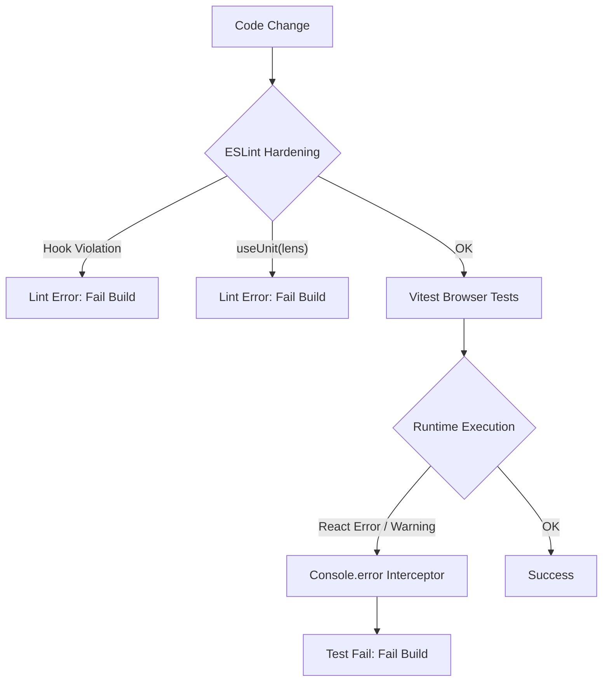

# Plan: Building a Predictable System for Fast-Food App

This plan outlines the steps to eliminate runtime surprises (like React Hook violations and Effector unit mismatches) by strengthening the development and testing feedback loops.

## 1. Problem Statement

The "Multi-App" refactoring introduced complexities that were missed by the current test suite:

1.  **React Hook Violations:** Calling hooks (`useLens`) inside `.map()` callbacks.
2.  **Effector Unit Mismatches:** Passing **Lenses** (which look like stores but aren't) to `useUnit`.
3.  **Silent Browser Failures:** These issues often only appear as console errors/warnings in the browser, which currently don't fail the Vitest integration tests.

## 2. Proposed Architecture for Reliability



## 3. Action Items

### 3.1. Integration Test Safety Net (Fail on Console Errors)

We will ensure that any error or warning printed to the browser console during a test fails that test.

- **Create `tools/vitest/setup-console.ts`**:
  - Use `vi.spyOn(console, 'error')` and `vi.spyOn(console, 'warn')`.
  - Throw an explicit `Error` when these are called.
  - **Refinement:** Filter out known noise (e.g., HMR updates) to avoid flaky tests.
- **Update root `vitest.config.ts`**:
  - Add the new setup file to the `test.setupFiles` array.

### 3.2. Static Analysis Hardening (ESLint)

Catch errors at the editor level before they reach the browser.

- **Configure `eslint-plugin-react-hooks`**:
  - Ensure `plugin:react-hooks/recommended` is active in the root `.eslintrc.json`.
  - **Refinement:** Apply specifically to `apps/**/*.{ts,tsx}` to avoid false positives in core packages.
- **Custom Rule for `useUnit(lens)`**:
  - Add a `no-restricted-syntax` rule to flag `useUnit` calls where the argument structure matches a Lens (e.g., accessing `facets` or `activeVariant` properties directly in the call).

### 3.3. API Guardrails & Runtime Validation

Improve the DX of the `@effector-model/core-experimental` library.

- **Enhance `isLens` and `select`**:
  - Add internal validation to provide descriptive error messages when passed invalid inputs.
- **Update `useLens` Hook**:
  - Add a development-only check to warn if the input is **a plain object** that is neither a Lens nor a Store.
  - **Refinement:** Allow primitives (string, number, null) to pass through without warning to support valid use cases like `useLens(null, fallback)`.

### 3.4. Architectural Guidelines for Developers

- **Component Extraction**: Instead of mapping over models and calling hooks in the loop, always extract a sub-component:

  ```tsx
  // BAD
  {
    items.map((item) => {
      const data = useLens(item.facets.data, null); // Hook violation!
      return <View data={data} />;
    });
  }

  // GOOD
  {
    items.map((item) => <ItemView key={item.id} item={item} />);
  }

  function ItemView({ item }) {
    const data = useLens(item.facets.data, null); // Safe
    return <View data={data} />;
  }
  ```

- **Lens vs Unit**: Remember that `getItem` returns a **Lens**. Use `useLens()` for Lenses and `useUnit()` for Stores/Events.

## 4. Verification Plan

1.  **Negative Testing**: Re-introduce a hook violation in a test and verify that `vitest` now fails the test suite.
2.  **Linting**: Run `pnpm lint` and ensure it catches the hook rules.
3.  **Type Safety**: Ensure `useLens` provides correct type inference for fallback values.
