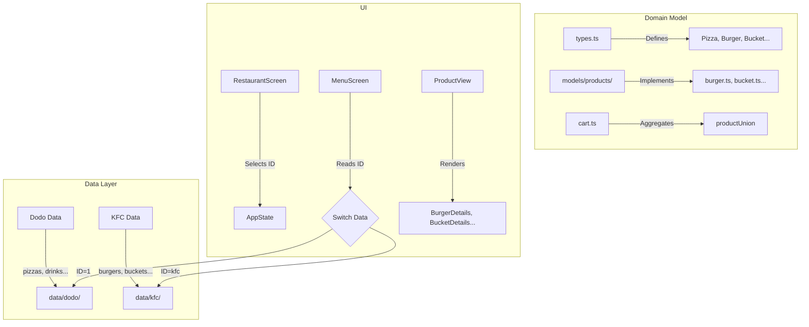

# KFC Shop Expansion Plan

This plan details the steps to introduce the KFC shop into the `models-research` application, ensuring a parallel structure to the existing Dodo Pizza implementation.

## 1. Directory Structure Refactoring

We will organize data by restaurant brand to support scalability.

- **Move** existing Dodo data:
  - `src/food/data/*.json` -> `src/food/data/dodo/*.json`
- **Create** KFC data directory:
  - `src/food/data/kfc/`

## 2. Domain Model Extension

We need to support new product types specific to KFC (Burgers, Buckets, etc.) while keeping traits generic.

### 2.1 Update Types (`src/food/types.ts`)

Add new interfaces extending `BaseProductData`:

- `BurgerData`: Uses `ingredients` (removable).
- `TwisterData`: Uses `ingredients` (removable).
- `BucketData`: Uses `sizes` (piece counts).
- `SnackData`: Uses `sizes` (Standard/Large).

### 2.2 Create Models (`src/food/models/products/`)

Create new model files implementing these types using existing generic traits:

- `burger.ts`: Uses `productTrait`, `ingredientsFacet` (for removing defaults).
- `twister.ts`: Uses `productTrait`, `ingredientsFacet`.
- `bucket.ts`: Uses `productTrait`, `sizeFacet`.
- `snack.ts`: Uses `productTrait`, `sizeFacet`.

### 2.3 Update Registry (`src/food/models/cart.ts`)

- Register new models in `productUnion`.

## 3. Data Generation (`src/food/data/kfc/`)

Create JSON files with realistic KFC Moscow menu data (approximate prices/names):

- `burgers.json`: Sanders Burger, Chefburger, Maestro.
- `twisters.json`: Twister Original, Twister Spicy.
- `buckets.json`: Basket S/M/L, Wings.
- `snacks.json`: Fries, Nuggets.
- `drinks.json`: Dobry Cola, Lipton, Coffee.
- `sauces.json`: Cheese, BBQ, Garlic.

## 4. UI Updates

### 4.1 Update Restaurant List (`src/food/view/RestaurantScreen.tsx`)

- Add KFC to the `RESTAURANTS` list with ID `kfc`.

### 4.2 Update Menu Screen (`src/food/view/MenuScreen.tsx`)

- Import new KFC JSON files.
- Implement logic to switch `CATEGORIES` based on `restaurantId`.
  - If `restaurantId === 'kfc'`, use KFC categories (Burgers, Buckets, etc.).
  - Else, use Dodo categories.

### 4.3 Update Product View (`src/food/view/components/ProductView.tsx`)

- Add cases to `Match` component for new variants (`burger`, `bucket`, `snack`, `twister`).
- Implement detail views:
  - `BurgerDetails`: Similar to Pizza but without dough selector.
  - `BucketDetails` & `SnackDetails`: Simple size selector.
  - `TwisterDetails`: Ingredient toggles.

## 5. Mermaid Diagram

