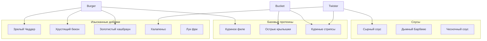

# План обновления: Изысканные ингредиенты KFC

Цель — улучшить данные меню KFC, добавив продуманные и реалистичные обновления ингредиентов, расширив возможности кастомизации и гарантируя, что данные отражают «лучшую возможную версию» текущих предложений KFC. Все пользовательские данные будут на русском языке.

## 1. Общий каталог ингредиентов (Улучшенные добавки)

Мы введем последовательный набор «дополнительных ингредиентов» для бургеров и твистеров:

- **Сырные улучшения**:
  - `cheddar`: Зрелый Чеддер (вместо обычного «Сыра») — 39 ₽
  - `cheese_sauce`: Сливочный сырный соус — 29 ₽
- **Протеиновые улучшения**:
  - `bacon_crispy`: Хрустящий копченый бекон — 49 ₽
  - `extra_fillet`: Дополнительное куриное филе (Оригинальное/Острое) — 99 ₽
- **Свежесть и хруст**:
  - `hashbrown`: Золотистый хашбраун (для апгрейда в стиле «Тауэр») — 59 ₽
  - `jalapeno`: Ломтики халапеньо (для остроты) — 29 ₽
  - `pickles_extra`: Дополнительные маринованные огурчики — 19 ₽
  - `fried_onion`: Хрустящий лук фри — 29 ₽
- **Соусы (дополнительно/замена)**:
  - `bbq_sauce`: Дымный соус Барбекю — 29 ₽
  - `garlic_sauce`: Чесночный соус с травами — 29 ₽

## 2. Специфические улучшения продуктов

### Бургеры ([`burgers.json`](apps/models-research/src/food/data/kfc/burgers.json))

- **Сандерс Бургер**: Добавить `extra_fillet`, `bacon_crispy`, `cheddar`.
- **Шефбургер**: Расширить опции, включив `hashbrown` (превращая его в вариант «Шефбургер Де Люкс») и `cheese_sauce`.
- **Маэстро Бургер**: Поскольку это «Премиум», мы позволим добавить `extra_fillet` и `fried_onion`, чтобы сделать его еще внушительнее.

### Твистеры ([`twisters.json`](apps/models-research/src/food/data/kfc/twisters.json))

- **Твистер Оригинальный**: Добавить `cheese_sauce`, `bacon_crispy` и `jalapeno`.
- **Твистер Де Люкс**: Добавить `hashbrown` и `extra_fillet`.

### Снеки ([`snacks.json`](apps/models-research/src/food/data/kfc/snacks.json))

- **Картофель Фри**: Уточнить описания.
- **Наггетсы**: Добавить вариант на 12 шт. для лучшего выбора.

### Баскеты ([`buckets.json`](apps/models-research/src/food/data/kfc/buckets.json))

- Сделать описания более «аппетитными».
- Убедиться, что `nutritionalInfo` присутствует для всех позиций.

## 3. Улучшения структуры данных

- Добавить плейсхолдеры для `image` (используя формат `/images/kfc/products/...`).
- Проверить точность `nutritionalInfo` (калории и вес).
- Убедиться, что `defaultIngredients` правильно перечислены, чтобы их можно было удалить в интерфейсе.

---

## Схема взаимосвязей ингредиентов (Mermaid)

## Следующие шаги

1.  Обновить JSON-файлы новыми списками ингредиентов (на русском языке).
2.  Улучшить описания для повышения маркетинговой привлекательности.
3.  Стандартизировать цены на добавки.
