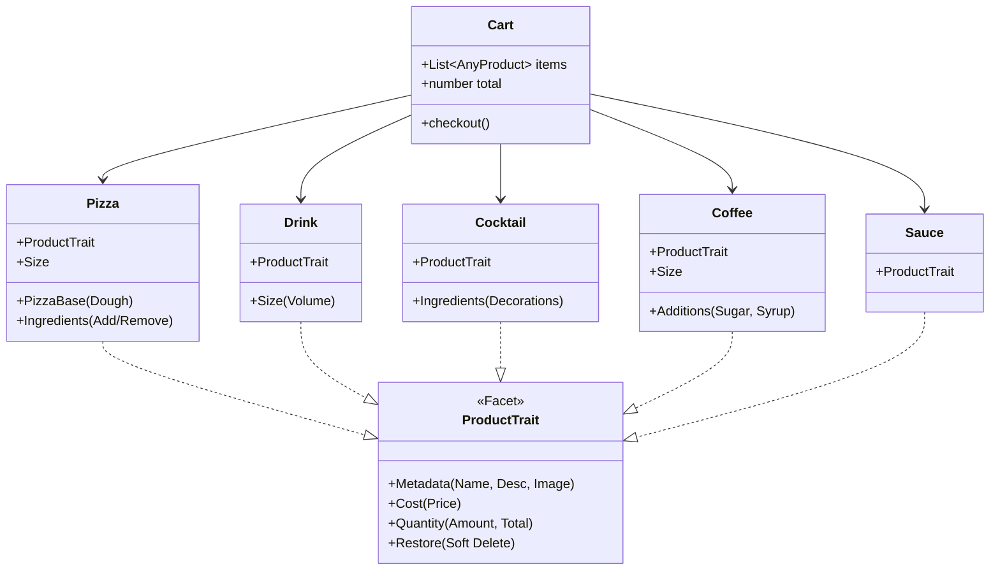

# Product Requirements Document (PRD)

**Project Name:** Pizza Demo App (Core Experimental Research)
**Version:** 2.3 (Final Polish)
**Status:** Approved for Implementation

---

## 1. Executive Summary & Technical Motivation

### 1.1. Goal

The primary goal is to re-implement the classic `food-order` demo using the new `@effector-model/core-experimental` API. This project serves as a research ground to demonstrate how the new **Model + Facets** architecture solves complex UI/UX challenges that were difficult or verbose in the previous version.

### 1.2. The Problem (Legacy `food-order`)

The original `food-order` app demonstrated basic list management but struggled with:

1.  **Polymorphism:** Handling different product types (Pizzas, Drinks, Cocktails, Sauces, Coffee) in a single cart required complex conditional logic or unified "mega-types".
2.  **Complex State Transitions:** Implementing "Soft Delete" (where a product stays in the list but changes state/controls) required managing auxiliary state flags and complex view logic.
3.  **Deep Updates:** Modifying a nested property (like an ingredient in a cart product) required traversing the entire store tree (`ordersList -> dishes -> additives`).

### 1.3. The Solution (New `models-research`)

The new architecture addresses these edge cases:

1.  **Union Models:** The Cart can hold a heterogeneous list of domain-specific models (`Pizza | Drink | Coffee | ...`), each exposing only the relevant capabilities.
2.  **Facets (Composition):** Shared behaviors like `ProductTrait` (Metadata, Cost, Quantity) are encapsulated in reusable Facets, decoupled from the specific domain entity.
3.  **State Machines:** The "Soft Delete" logic is internalized within the `Restore` facet, simplifying the View to just reacting to `$isDeleted`.

---

## 2. Architecture Overview

The app is built around the concept of **Composable Domain Models**.

We define a **Product Trait** (Facet) that includes the core business capabilities: `Metadata`, `Cost`, `Quantity`, and `Restore`. Specific domain entities (Pizza, Coffee, etc.) implement this trait and add their own specific facets.

---

## 3. User Personas & Flow

**User:** A hungry customer wanting to customize and order food quickly via mobile.

**Core User Flow:**

1.  **Select Restaurant:** Choose a context (Restaurant A vs B).
2.  **Browse Menu:** Scroll through categories with sticky navigation.
3.  **Customize Product:** Select size, dough, and modify ingredients.
4.  **Add to Cart:** Confirm configuration.
5.  **Manage Cart:** Adjust quantities, soft-delete items, or restore them.
6.  **Checkout:** Submit order.

---

## 4. Screen Specifications

### 4.0. Screen: Restaurant Selection (Entry)

- **Header:** "Select Restaurant"
- **List:** Cards with Image, Name, Tags (e.g., "Italian", "Burgers").
- **Action:** Clicking a card navigates to the **Menu List**.
- **Data Note:** Each restaurant has its own isolated set of Products and Categories.

### 4.1. Screen: Menu List (Home)

- **Sticky Navigation:**
  - Top anchor bar linking to categories (Pizza, Snacks, Drinks).
  - **Scroll-spy:** Active tab updates automatically as user scrolls.
- **Product List:**
  - Grouped by Category.
  - **Card:**
    - **Visual:** Emoji or Image.
    - **Info:** Name, static description (default ingredients).
    - **Price:** "from [Min Price]" chip (bottom-center, non-clickable).
- **Global Cart FAB:**
  - **Position:** Bottom Right (Fixed).
  - **Visual:** Cart Emoji + Total Price.
  - **Action:** Opens **Cart Screen**.

### 4.2. Screen: Product Detail (Configurator)

- **Navigation:** Close button (Top Left).
- **Visuals:**
  - Large Product Image.
  - **"Customize Ingredients" FAB:** Secondary floating button below image (Icon: Pencil, Text: "Настроить состав"). Opens **Ingredients Screen**.
- **Controls:**
  - **Selectors:** Dynamic based on Product Type.
    - _Pizza:_ Size ("20", "30" cm), Dough ("Thin", "Traditional").
    - _Coffee:_ Size ("S", "M", "L"), Sugar.
    - _Generic:_ Just Size or None.
- **Primary Action (Sticky Footer):**
  - **Button:** "Add to Cart [Price]" (or Plus sign).
  - **Logic:** Adds configured item to Cart -> Returns to Menu.

### 4.3. Screen: Ingredients Customization

- **Navigation:** Close button (Top Left).
- **Header:** Product Name + Current Config (e.g., "30cm, Traditional").
- **Section 1: "Add to Taste" (Extras)**
  - **Layout:** Grid of tiles.
  - **Item:** Icon/Emoji + Name + Price.
  - **Interaction:** Toggle (Select/Deselect). Adds to price.
- **Section 2: "Remove Ingredients" (Defaults)**
  - **Layout:** Wrapped list of chips.
  - **Item:** Name + "X" icon.
  - **Interaction:** Toggle.
    - _Default:_ Normal text.
    - _Removed:_ Strikethrough text (Crossed out).
    - _Note:_ Removing ingredients does **not** lower the price.
- **Section 3: Product Metadata**
  - **Content:** Nutritional info (Energy, Weight), Description.
- **Footer:** "Save [Total Price]" button.

### 4.4. Screen: Cart

- **Header:** Back Button (Left), Clear Button (Right).
- **List:**
  - **Item Card:**
    - **Info:** Name, Config ("35cm, Thin"), Modifications ("+ Cheese, - Onion").
    - **Price:** Total for this line item.
    - **Edit Button:** Opens **Product Detail** in "Edit Mode".
    - **Quantity Controls:** [ - ] [ Count ] [ + ]
- **Footer:** "Checkout for [Total]" button.

### 4.5. Screen: Checkout / Success

- **Flow:**
  1.  User clicks "Checkout" in Cart.
  2.  **Loading State:** Interface blocked, spinner shown.
  3.  **Success State:**
      - Cart is cleared.
      - **Visuals:** Large Congrats Emoji/Illustration.
      - **Message:** "Order successfully placed!"
      - **Action:** Main button "Return to Menu".

---

## 5. Detailed Business Logic & Edge Cases

### 5.1. Price Calculation Algorithm

The price is dynamic and depends on the specific item type:
$$ \text{Price} = (\text{Base} + \text{SizeMod} + \text{DoughMod} + \sum \text{Extras}) \times \text{Quantity} $$

- **Constraint:** Removing default ingredients (Section 2) does _not_ decrease the price.
- **Constraint:** Changing Size/Dough updates the Base Price immediately.

### 5.2. Soft Delete & Restoration (The "Restore" Facet)

This is a critical UX pattern to prevent accidental data loss.

1.  **Trigger:** User clicks "Minus" when Quantity is 1.
2.  **State Transition:** Item enters `SoftDeleted` state.
3.  **UI Updates:**
    - Item Opacity: Reduced (Dimmed).
    - Secondary Button: Changes from "Edit" to **"Delete"** (Hard Delete).
    - Quantity Controls: Replaced by single **"Restore"** button ("Вернуть").
4.  **Restoration:** Clicking "Restore" -> Item returns to `Active` state (Quantity 1, Normal Opacity).
5.  **Hard Delete:** Clicking "Delete" -> Item is removed from the list permanently.

### 5.3. Configuration Persistence

- **Editing:** When clicking "Edit" in Cart, the Product Detail screen must initialize with the _specific_ configuration of that cart item, not the default values.
- **Saving:** Clicking "Save" in Product Detail updates the _existing_ cart item (mutation), rather than adding a new one.

### 5.4. Navigation Logic

- **Scroll Spy:** Must handle variable section heights. Active tab should switch when the section header is near the top (e.g., 20% viewport offset).
- **Routing:**
  - Menu -> Product -> Cart -> Menu.
  - Cart -> Checkout -> Success -> Menu.

---

## 6. Visual Guidelines (Dodo-like)

- **Primary Color:** Orange (`#ff6900`).
- **Typography:** Clean, sans-serif, bold headers.
- **Layout:** Card-based, generous padding.
- **Feedback:** Ripple effects on clicks, smooth transitions for "Soft Delete" dimming.
